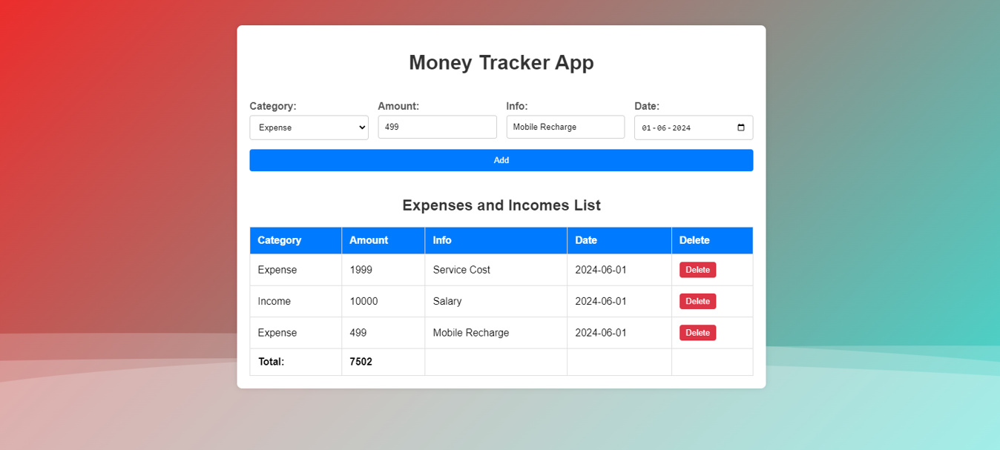

### README for Money Tracker By - Aritram Sarkar

---

## Money Tracker App

Money Tracker App is a simple web application that helps you track your income and expenses. You can add records for your financial transactions, view them in a list, and see the total balance.

### Screenshot



### Features

- **Add Transactions**: Add details of your income and expenses.
- **View Transactions**: See a list of all transactions with details.
- **Delete Transactions**: Remove transactions from the list.
- **Total Balance**: View the current balance calculated from your income and expenses.

### Technologies Used

- **Backend**: Node.js, Express.js
- **Frontend**: HTML, CSS, JavaScript
- **Database**: MongoDB

### Getting Started

#### Prerequisites

- Node.js installed on your machine
- MongoDB installed and running

#### Installation

1. **Install dependencies**
   ```sh
   npm install
   ```

2. **Ensure MongoDB is running**

3. **Start the application**
   ```sh
   node index.js
   ```

4. **Open your browser and navigate to**
   ```
   http://localhost:5000
   ```

### Project Structure

```plaintext
money-tracker-app/
│
├── public/
│   ├── index.html
│   ├── style.css
│   └── script.js
│
├── node_modules/
│
├── package.json
├── index.js
└── README.md
```

### Code Overview

#### Backend (index.js)

- **Express Server**: Sets up an Express server and connects to MongoDB.
- **Routes**:
  - `POST /add`: Adds a new transaction to the database.
  - `GET /`: Serves the main HTML page.

#### Frontend (public/index.html, public/style.css, public/script.js)

- **HTML**: Structure of the app including the form and table for transactions.
- **CSS**: Styling for the app to make it look attractive.
- **JavaScript**: Handles adding transactions, updating the list, and calculating the total balance.

### Usage

1. **Adding a Transaction**:
   - Fill in the form with the transaction details (Category, Amount, Info, Date).
   - Click the "Add" button to add the transaction.

2. **Viewing Transactions**:
   - The list below the form shows all transactions.
   - The total balance is updated automatically.

3. **Deleting a Transaction**:
   - Click the "Delete" button next to a transaction to remove it.
   - The total balance is updated automatically.

### Contributing

Contributions are welcome! Please open an issue or submit a pull request.

### License

This project is licensed under the MIT License.

---

**Author**: Aritram Sarkar
[Your GitHub](https://github.com/aritram26)
